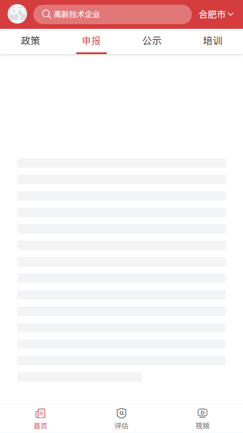

# policyList

使用爬虫技术爬取政府网站政策新闻，使用混合开发，当前仓库为网页源码，更多详情：http://www.ave.cc/
线上预览地址：http://qxf.ave.cc/#/home

## Project setup
```
npm install
```

### Compiles and hot-reloads for development
```
npm run serve
```

### Compiles and minifies for production
```
npm run build
```

### Run your tests
```
npm run test
```

### Lints and fixes files
```
npm run lint
```

### Customize configuration
See [Configuration Reference](https://cli.vuejs.org/config/).
